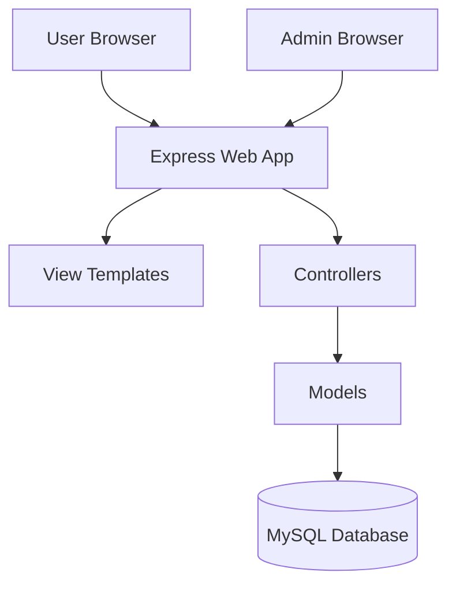
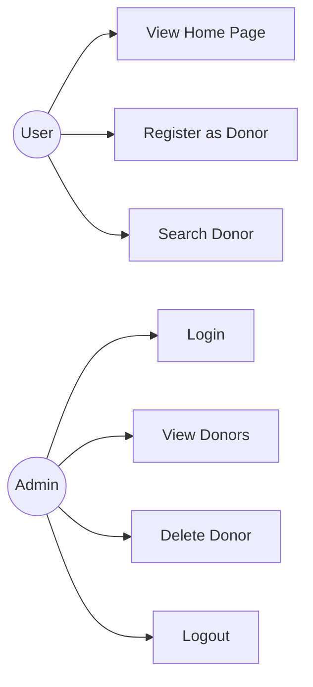
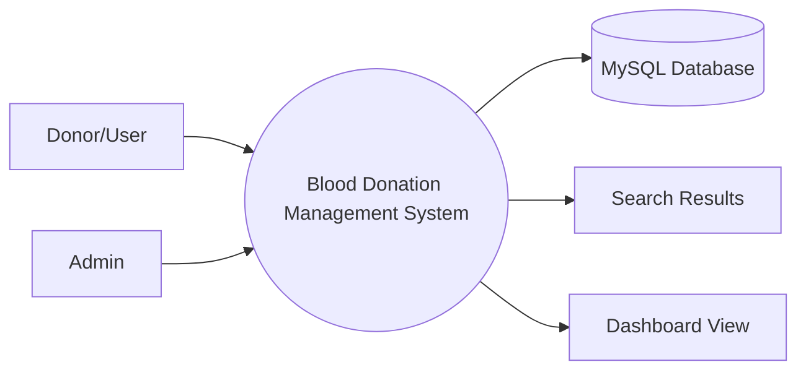
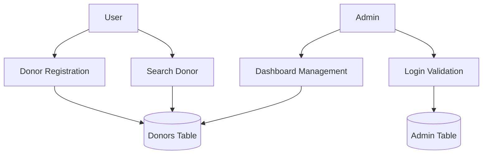
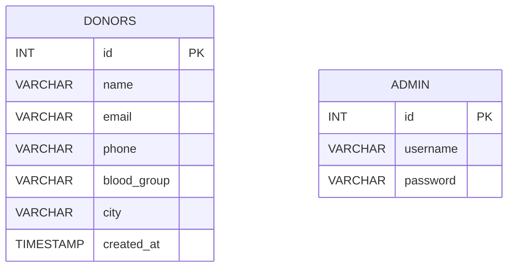

# Blood Donation Management System
## Academic Project Report

## 1. Cover Page
**Project Title:** Blood Donation Management System

**Submitted By:** Student Name

**Roll Number:** __________

**Branch:** Computer Science and Engineering

**College:** __________

**Session:** 2025-26

**Project Type:** Academic Project

---

## 2. Certificate
This is to certify that the project titled **Blood Donation Management System** is an original work carried out by the student under the guidance of the project supervisor. The project demonstrates practical application of web development, database design, and software engineering concepts.

---

## 3. Declaration
I hereby declare that the project titled **Blood Donation Management System** is my original work and has not been submitted elsewhere for any other degree or diploma.

---

## 4. Acknowledgement
I express my sincere gratitude to my project guide, faculty members, and college for their support. I also thank the open-source community and documentation sources that helped in the completion of this mini project.

---

## 5. Abstract
Blood Donation Management System is a web-based mini project designed to store donor details, help users search donors by blood group and city, and allow an administrator to manage records securely. The system is built using HTML, CSS, JavaScript, Node.js, Express.js, and MySQL. It supports donor registration, structured database storage, secure login, session management, responsive design, and deployment on Vercel. The application is suitable for urgent donor lookup and can be completed within 24 hours by a B.Tech student with basic web development knowledge.

---

## 6. Table of Contents
1. Cover Page
2. Certificate
3. Declaration
4. Acknowledgement
5. Abstract
6. Table of Contents
7. Introduction
8. Problem Statement
9. Objectives
10. Existing System
11. Proposed System
12. Requirement Analysis
13. System Architecture
14. Use Case Diagram
15. DFD Level 0
16. DFD Level 1
17. ER Diagram
18. Database Design
19. Module Description
20. Implementation Details
21. Screenshots Section
22. Testing
23. Advantages
24. Limitations
25. Future Scope
26. Conclusion
27. References

---

## 7. Introduction
Blood donation is a critical social activity that can save lives during accidents, surgeries, and emergencies. However, locating the right donor quickly is often difficult when records are scattered or manually maintained. This project digitises donor information and enables fast search based on blood group and city.

### Project Importance
- Reduces delay in finding donors.
- Organises data in a structured MySQL database.
- Provides a simple interface for students, teachers, and local organisations.
- Demonstrates full-stack web application development.

---

## 8. Problem Statement
In many places, donor information is stored in notebooks, Excel sheets, or informal contact lists. These methods are slow, error-prone, and difficult to search. In emergency situations, there is no central system to identify suitable donors quickly. The Blood Donation Management System solves this by providing a searchable, secure, and responsive web application.

---

## 9. Objectives
- Register donor details in a database.
- Search donors by blood group and city.
- Provide secure admin login with session support.
- Display all registered donors in an admin dashboard.
- Allow deletion of invalid or outdated donor records.
- Offer a clean and mobile responsive interface.
- Prepare the project for quick deployment on Vercel.

---

## 10. Existing System
The existing manual system has the following limitations:
- Records are stored in notebooks or spreadsheets.
- Searching takes time.
- Duplicate or outdated entries are difficult to identify.
- Data is not protected by authentication.
- The system does not scale well for college or community use.

### Drawbacks
- Low speed
- Low accuracy
- No centralised storage
- No access control
- Poor user experience

---

## 11. Proposed System
The proposed system is a web application that maintains donor data in MySQL and allows users to search records instantly. An admin can log in securely, view all donors, and delete records when needed.

### Key Features
- Responsive UI
- Client-side validation
- Server-side validation
- MySQL backed storage
- Secure admin session
- Search by blood group and city

---

## 12. Requirement Analysis

### Functional Requirements
- Donor registration form
- Donor search form
- Admin authentication
- Admin dashboard listing donors
- Delete action for donor records

### Non-Functional Requirements
- Responsive design
- Data security
- Ease of use
- Maintainability
- Fast response for search queries

### Hardware Requirements
- Minimum 4 GB RAM
- Basic dual-core processor
- Internet connection for deployment

### Software Requirements
- Node.js
- MySQL
- Vercel account
- Modern browser

---

## 13. System Architecture

### Architecture Explanation
The browser sends HTTP requests to the Express application. Controllers handle routing logic and call the model layer. Models execute SQL queries on MySQL. The views layer renders HTML pages and the public folder serves CSS and JavaScript assets.

---

## 14. Use Case Diagram

---

## 15. DFD Level 0

---

## 16. DFD Level 1

---

## 17. ER Diagram

---

## 18. Database Design

### Database Name
`blood_donation_db`

### Table: donors
| Field | Type | Description |
|---|---|---|
| id | INT AUTO_INCREMENT PRIMARY KEY | Unique donor ID |
| name | VARCHAR(100) | Donor full name |
| email | VARCHAR(100) | Email address |
| phone | VARCHAR(15) | Phone number |
| blood_group | VARCHAR(5) | Donor blood group |
| city | VARCHAR(50) | City of the donor |
| created_at | TIMESTAMP | Registration time |

### Table: admin
| Field | Type | Description |
|---|---|---|
| id | INT AUTO_INCREMENT PRIMARY KEY | Unique admin ID |
| username | VARCHAR(50) | Login username |
| password | VARCHAR(255) | Hashed password |

### Schema Explanation
The donors table stores all donor contact details in a structured way. The admin table stores login data for dashboard access. The password is hashed using PBKDF2 for safer storage.

---

## 19. Module Description

### Home Page
Shows introduction, project objective, awareness content, and navigation.

### Donor Registration
Collects donor details and stores them in MySQL after validation.

### Search Donor
Allows filtering by blood group and city and displays matched records in a table.

### Admin Login
Validates the admin username and password and starts a secure session.

### Admin Dashboard
Displays all donor records and provides delete and logout options.

---

## 20. Implementation Details

### Frontend
- Built with HTML5 and CSS3
- Vanilla JavaScript handles form validation and mobile navigation
- Responsive grid layout ensures mobile compatibility

### Backend
- Express.js handles routing and HTTP request processing
- Controllers separate business logic from routes
- Models execute parameterised MySQL queries

### Session Management
The admin login stores an authenticated user object inside the session. The dashboard route is protected using middleware.

### API Endpoint Documentation
| Method | Endpoint | Purpose |
|---|---|---|
| GET | / | Home page |
| GET | /register | Donor registration form |
| POST | /register | Save donor data |
| GET | /search | Search donor page |
| GET | /admin/login | Admin login page |
| POST | /admin/login | Validate admin login |
| GET | /admin/dashboard | View donor dashboard |
| POST | /admin/donor/:id/delete | Delete donor record |
| GET | /admin/logout | End session |

### Project Flow Explanation
1. The user opens the home page.
2. The donor submits the registration form.
3. The data is stored in MySQL.
4. A search request finds matching donors.
5. The admin logs in using session-based authentication.
6. The dashboard displays all donors and allows deletion.

---

## 21. Screenshots Section
Insert actual screenshots after running the application locally.

### Placeholder List
- Home Page
- Donor Registration Page
- Search Donor Page
- Admin Login Page
- Admin Dashboard

### Screenshot Placeholder Format
- [Screenshot Placeholder: Home Page]
- [Screenshot Placeholder: Donor Registration Form]
- [Screenshot Placeholder: Search Results]
- [Screenshot Placeholder: Admin Login]
- [Screenshot Placeholder: Admin Dashboard]

---

## 22. Testing

### Test Cases
| Test ID | Test Scenario | Input | Expected Result | Status |
|---|---|---|---|---|
| TC01 | Load home page | Open `/` | Home page loads successfully | Pass |
| TC02 | Valid donor registration | Correct details | Donor saved in database | Pass |
| TC03 | Invalid donor email | Wrong email | Validation error shown | Pass |
| TC04 | Search donor by city | Blood group + city | Matching rows displayed | Pass |
| TC05 | Admin login | admin / admin123 | Redirect to dashboard | Pass |
| TC06 | Delete donor | Click delete | Record removed from dashboard | Pass |
| TC07 | Logout admin | Click logout | Session destroyed | Pass |

### Testing Notes
Both client-side and server-side validation are included to reduce invalid input and improve reliability.

---

## 23. Advantages
- Simple and easy to use
- Fast donor search
- Centralised data storage
- Responsive design for mobile and desktop
- Secure admin dashboard
- Easy to explain in viva

---

## 24. Limitations
- Serverless sessions on Vercel are suitable for demonstration, not large production loads
- No OTP or email verification
- No donor availability scheduling
- No blood bank integration

---

## 25. Future Scope
- Add donor update feature
- Add email or SMS notifications
- Add blood bank integration
- Add OTP-based authentication
- Add donor availability status
- Add pagination and advanced search
- Add analytics dashboard for donation trends

---

## 26. Conclusion
The Blood Donation Management System successfully demonstrates a complete mini project with registration, search, authentication, and administrative control. It follows a clear architecture, uses a structured database, and provides a modern responsive UI. The project is compact enough to finish within 24 hours and strong enough for academic submission and viva explanation.

---

## 27. References
- Node.js official documentation
- Express.js official documentation
- MySQL documentation
- Vercel deployment documentation
- MDN Web Docs

---

## Viva-Oriented Explanations

### Why Node.js and Express?
They allow fast development of server-side JavaScript with easy route and middleware handling.

### Why MySQL?
MySQL is reliable for structured relational data such as donor details and admin accounts.

### Why session management?
It protects admin pages by keeping the authenticated state after login.

### Why client-side validation?
It reduces unnecessary server requests and gives immediate user feedback.

### Why parameterised queries?
They help prevent SQL injection attacks.
